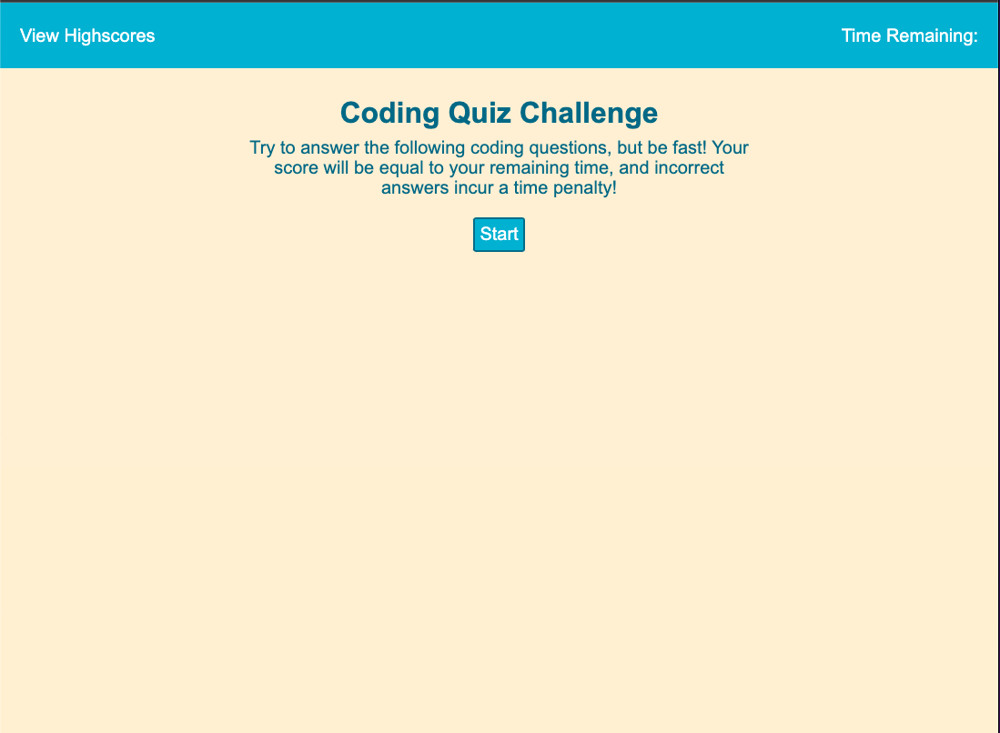
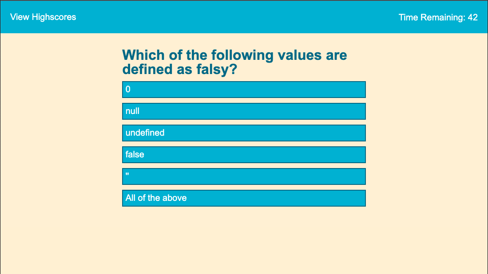
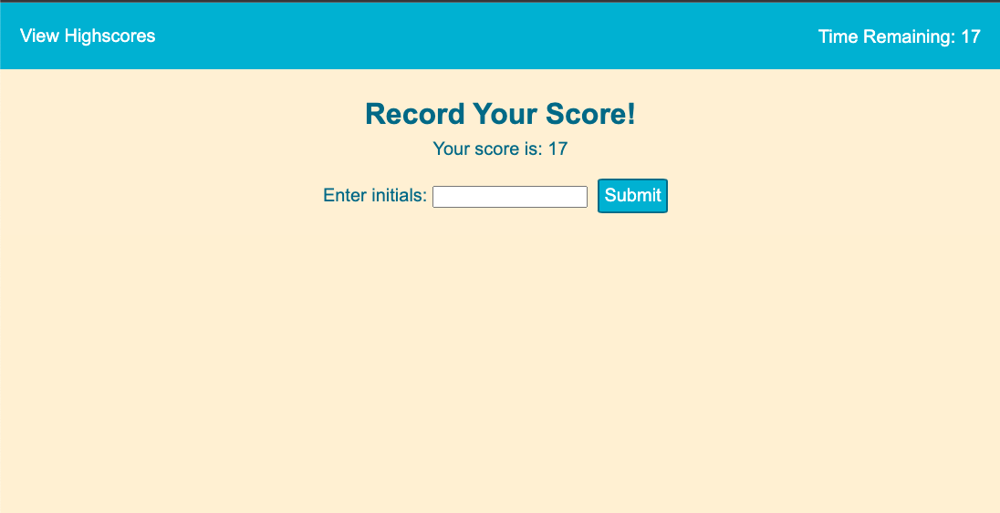
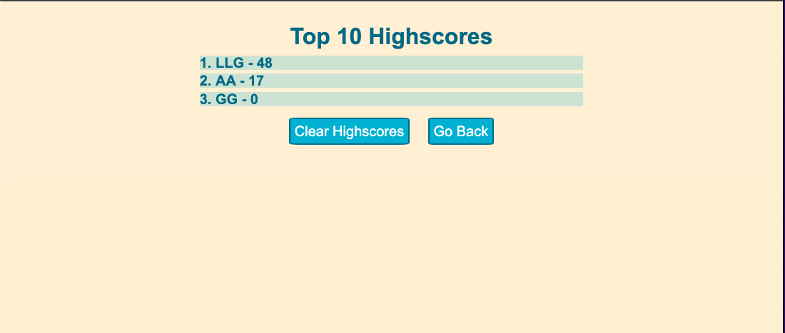

# Code Quiz

## Description

This project is an interactive multiple choice quiz. The user must answer multiple choice questions relating to coding before the timer runs out. For each incorrect answer, there is a time penalty. The user's final score is equal to the remaining time. The faster you are, the better your score!

After either the timer runs out, or the user has answered all the questions, they have the opportunity to add their initials to be tracked on the leaderboard. Their initials are saved along with their score to local storage. 

After adding their initials, the user is taken to the leaderboard page, which shows the top ten scores and their corresponding initials. 

This project was an excercise in editing the DOM via JavaScript, saving to local storage, controlling the flow of a game, and ensuring the HTML is responsive to a variety of screen sizes.

## Installation

The Code Quiz is available here:[https://lucygouvin.github.io/code-quiz/](https://lucygouvin.github.io/code-quiz/)

## Usage
1. Press the Start button to begin the quiz
    1. Alternatively, you can click on the "View Highscores" link in the header to go directly to the leaderboard.
2. You'll be presented with a question and multiple choice options. Select an answer.
    1. Incorrect answers will incur a time penalty and decrement your remaining time.
    2. "Correct" or "Incorrect" will appear to let you know whether your answer was correct
3. When you run out of questions, or the timer reaches zero, you'll be prompted to input your initials. You must input your initials in order to submit. 
    1. If you do not input initials, an error message will appear
4. You'll be redirected to the leaderboard page, which shows the top ten scores. 
5. Press "Clear Highscores" to erase all highscores. 
6. Press "Go Back" to return to the index. 

## Credits
Reference for sorting an array of objects: [https://www.scaler.com/topics/javascript-sort-an-array-of-objects/](https://www.scaler.com/topics/javascript-sort-an-array-of-objects/)

## License

Please see the license in this GitHub repository.
